# Examples

This page mirrors the runnable scripts under `examples/` and shows common usage patterns.

## Run example scripts

From repository root:

```bash
/workspaces/plotcdf/.venv/bin/python examples/bernoulli.py
/workspaces/plotcdf/.venv/bin/python examples/binomial.py
/workspaces/plotcdf/.venv/bin/python examples/poisson.py
```

Generated images are saved under:

- `examples/bernoulli_output/`
- `examples/binomial_output/`
- `examples/poisson_output/`

## Bernoulli example

```python
from plotcdf.discrete import plot

p = 0.5
bernoulli = plot.RV(support=[0, 1], prob=[1 - p, p])

fig_cdf, ax_cdf = bernoulli.plot_cdf(rv_name="bernoulli", save=False)
fig_pmf, ax_pmf = bernoulli.plot_pmf(rv_name="bernoulli", save=False)
fig_q, ax_q = bernoulli.plot_quantile(rv_name="bernoulli", save=False)
```

### Output plots

!!! example "Bernoulli PMF"
	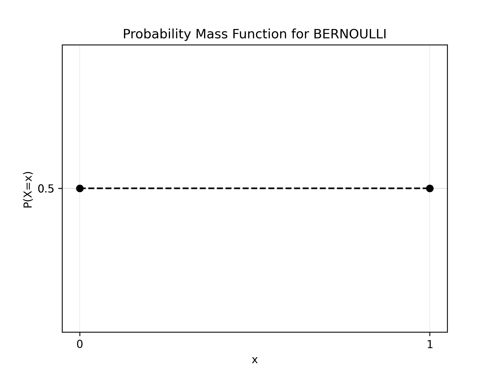
	PMF: two mass points at 0 and 1 with probabilities 0.5 and 0.5.

!!! example "Bernoulli CDF"
	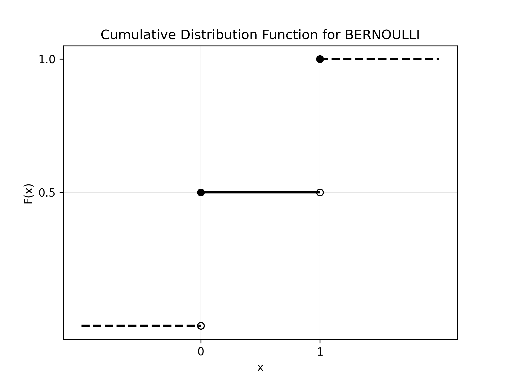
	CDF: one jump at 0 and a final jump to 1 at 1.

!!! example "Bernoulli quantile"
	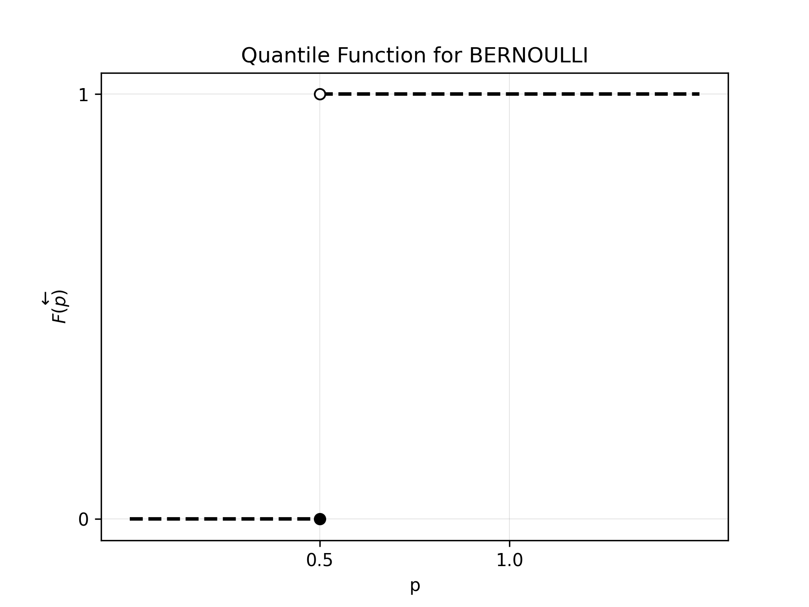
	Quantile: step mapping from probability levels to the two support values.

## Binomial example

```python
from scipy.stats import binom
from plotcdf.discrete import plot

n = 5
p = 0.5
rv = binom(n=n, p=p)

support = range(int(rv.ppf(0)) + 1, int(rv.ppf(1)) + 1)
prob = rv.pmf(support)

binomial_rv = plot.RV(support=support, prob=prob)

fig_cdf, ax_cdf = binomial_rv.plot_cdf(rv_name="binomial", save=False)
fig_pmf, ax_pmf = binomial_rv.plot_pmf(rv_name="binomial", save=False)
fig_q, ax_q = binomial_rv.plot_quantile(rv_name="binomial", save=False)
```

### Output plots

!!! example "Binomial PMF"
	
	PMF: finite support over integers 0 through 5 for n=5, p=0.5.

!!! example "Binomial CDF"
	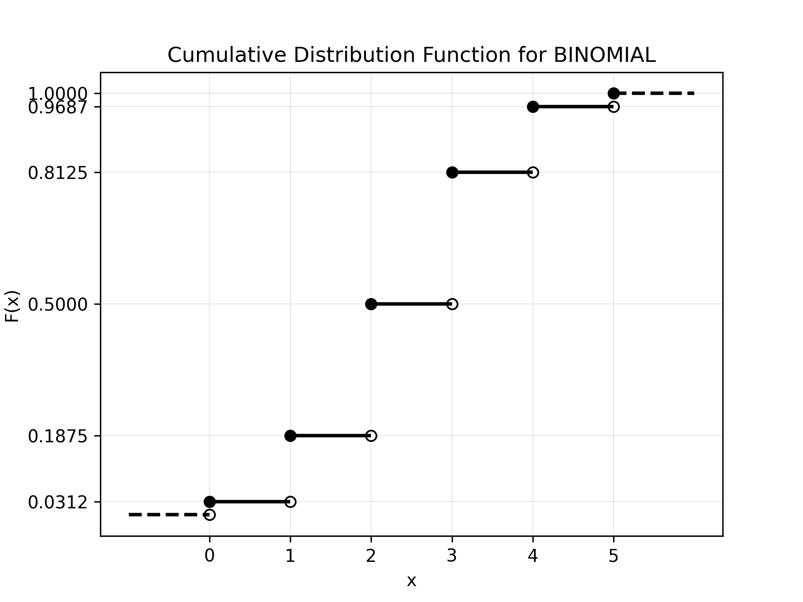
	CDF: monotone staircase with complete left and right tails.

!!! example "Binomial quantile"
	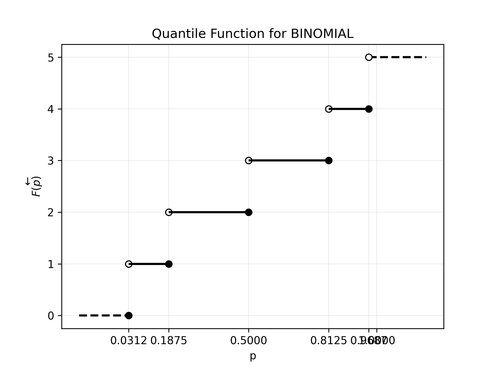
	Quantile: inverse-step behavior matching the binomial cumulative jumps.

## Poisson example (incomplete tails)

```python
from scipy.stats import poisson
from plotcdf.discrete import plot

mu = 3
rv = poisson(mu=mu)

# Incomplete right tail
support = range(int(rv.ppf(0)) + 1, int(rv.ppf(0.95)) + 1)
prob = rv.pmf(support)
poisson_rv = plot.RV(support=support, prob=prob, complete_right=False)

fig_cdf, ax_cdf = poisson_rv.plot_cdf(rv_name="poisson", save=False)
fig_pmf, ax_pmf = poisson_rv.plot_pmf(rv_name="poisson", save=False)
fig_q, ax_q = poisson_rv.plot_quantile(rv_name="poisson", save=False)
```

If you provide cumulative probabilities instead of PMF values, initialize with `is_pmf=False`.

### Output plots (incomplete right tail)

!!! example "Poisson PMF (incomplete right tail)"
	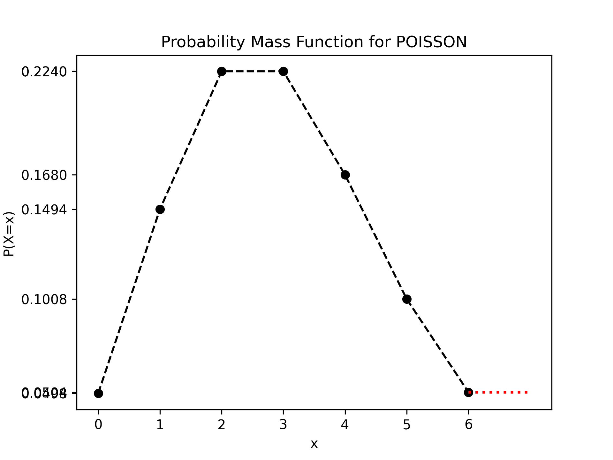
	PMF: right tail is truncated, so complete_right=False is used.

!!! example "Poisson CDF (incomplete right tail)"
	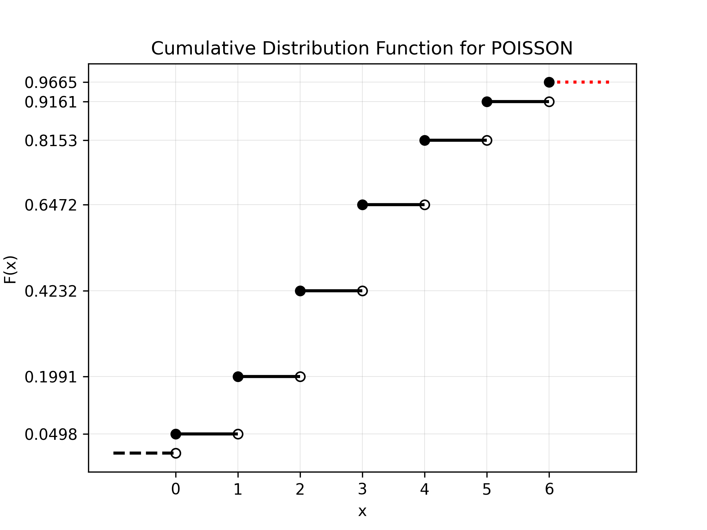
	CDF: right boundary indicates incomplete mass beyond the plotted support.

!!! example "Poisson quantile (incomplete right tail)"
	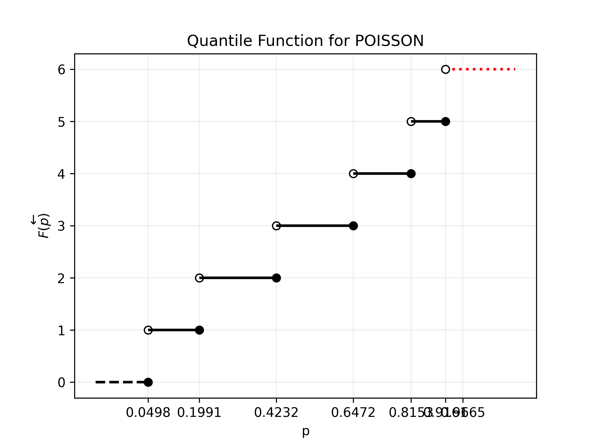
	Quantile: upper end reflects truncation of the right tail.

### Output plots (incomplete left and right tails)

!!! example "Poisson PMF (both tails incomplete)"
	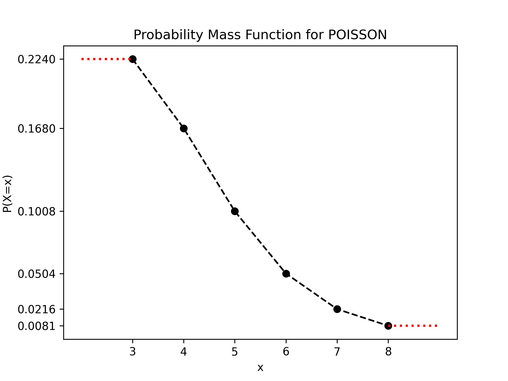
	PMF: both left and right tails are truncated (complete_left=False, complete_right=False).

!!! example "Poisson CDF (both tails incomplete)"
	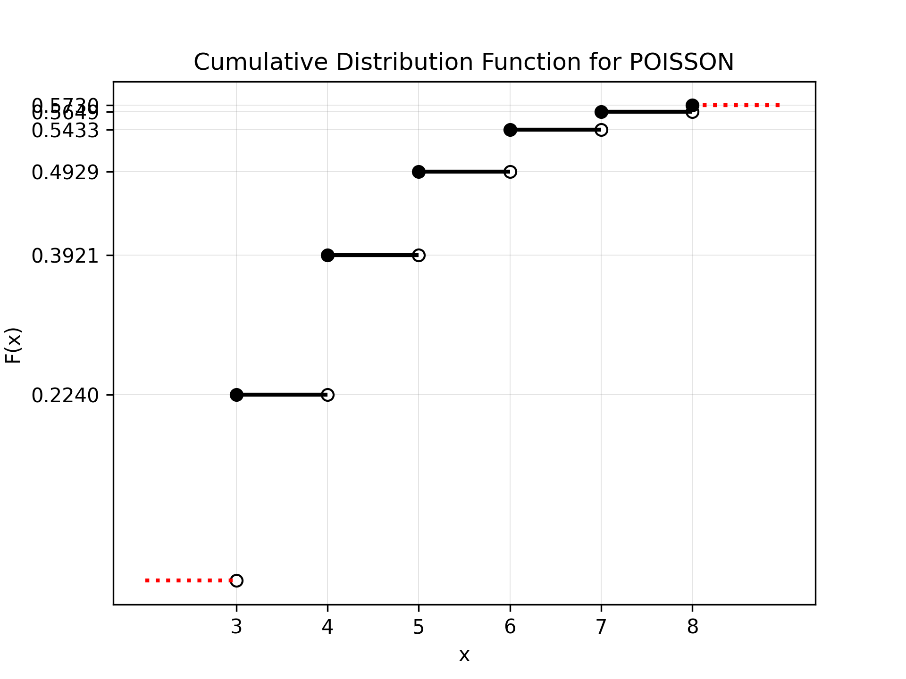
	CDF: both boundary segments indicate missing probability mass outside plotted support.

!!! example "Poisson quantile (both tails incomplete)"
	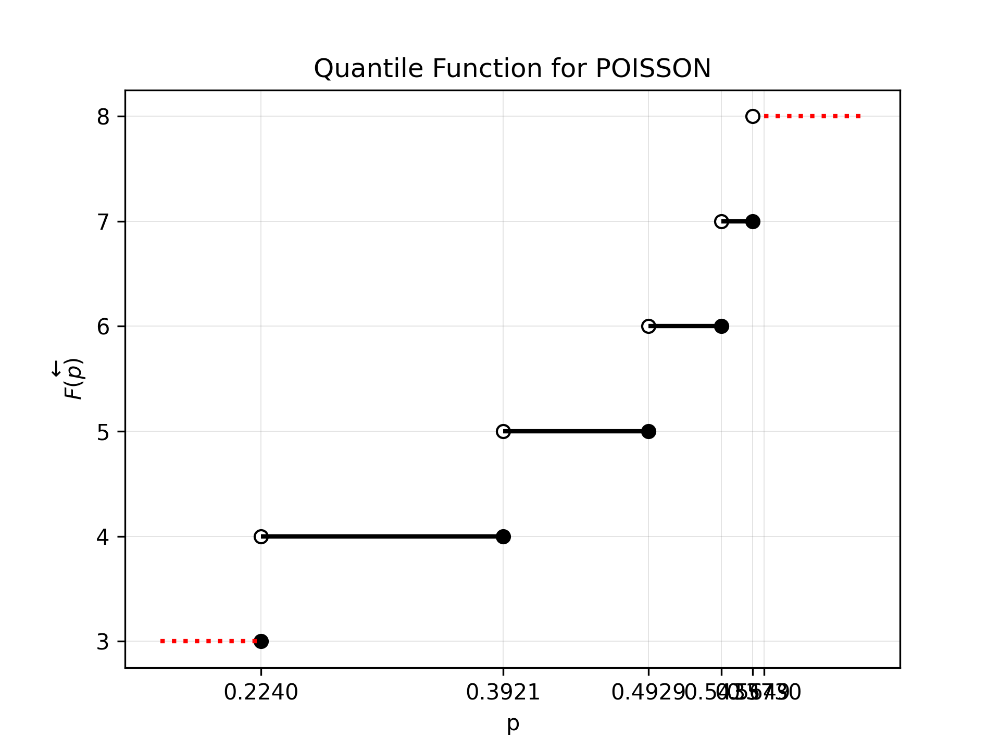
	Quantile: both lower and upper boundaries reflect incomplete tails.
